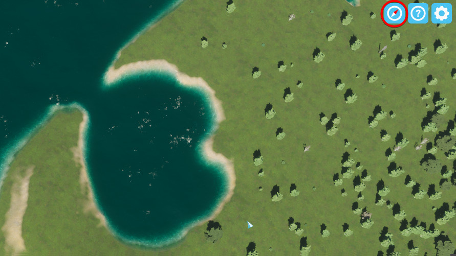

Compass is a mod for Cities: Skylines 2 that adds a new dynamic icon to the game allowing you to always see which direction your camera is relative to North.

Download Here: [https://mods.paradoxplaza.com/mods/86260/Windows](https://mods.paradoxplaza.com/mods/86260/Windows)

# Settings

The mod has two display modes. The first, Compass Wheel Mode shows a compact compass wheel icon. The second, Cardinal Direction Mode displays the cardinal direction (such as N, NW, E, etc).

In the settings window, the heading can be precisely changed, and a Reset To North button is included.

# Notes

This mod works in game and in the editor.

In game, the icon is added to the top right corner near the settings icon,

while in the editor it is added to the top left corner next to the natural resource panel shortcut.

# Conclusion

If you like this mod be sure to leave an upvote! Thanks