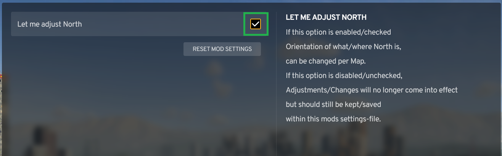
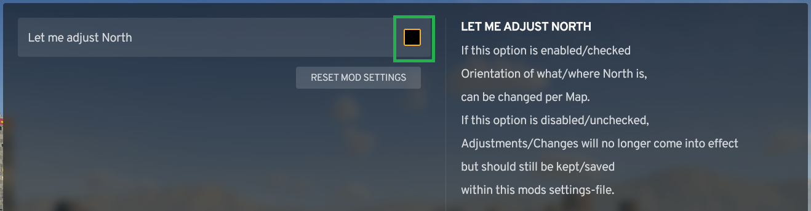

Compass is a mod for Cities: Skylines 2 that adds a new dynamic icon to the game allowing you to always see which direction your camera is relative to North.

Download Here: [https://mods.paradoxplaza.com/mods/86260/Windows](https://mods.paradoxplaza.com/mods/86260/Windows)

# Settings
## In-Game and Editor

The mod has two display modes.

The first, Compass Wheel Mode shows a compact compass wheel icon.

The second, Cardinal Direction Mode displays the cardinal direction (such as N, NW, E, etc).

In the settings window, the heading can be precisely changed, and a Reset To North button is included.

## 'Let me adjust North' is enabled
If 'Let me adjust North' is enabled within this mods Settings that are reachable from the menu

between the Heading-Slider and the four buttons, one for each major direction, under certain circumstances the buttons 'Make North' and 'Reset North' are displayed.

If North is adjusted, 'Reset North' is displayed. Otherwise, its not.

If not facing North, 'Make North' is displayed.

If facing North, 'Make North' is hidden.

Adjustments/Changes are kept/saved within this mods Settings-File.

## 'Let me adjust North' is disabled
If 'Let me adjust North' is disabled within this mods Settings that are reachable from the menu

the buttons 'Make North' and 'Reset North' arent displayed.

For those who only want to use the Compass-Mod, but do not want to adjust the direction of North.

Adjustments/Changes made while 'Let me adjust North' will no longer be effective but should still be kept/saved within this mods Settings-File.

# Notes

This mod works in game and in the editor.

In game, the icon is added to the top right corner near the settings icon,

while in the editor it is added to the top left corner next to the natural resource panel shortcut.

# Conclusion

If you like this mod be sure to leave an upvote! Thanks